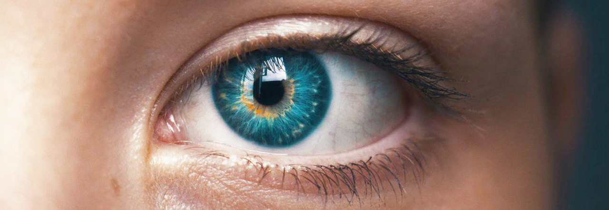
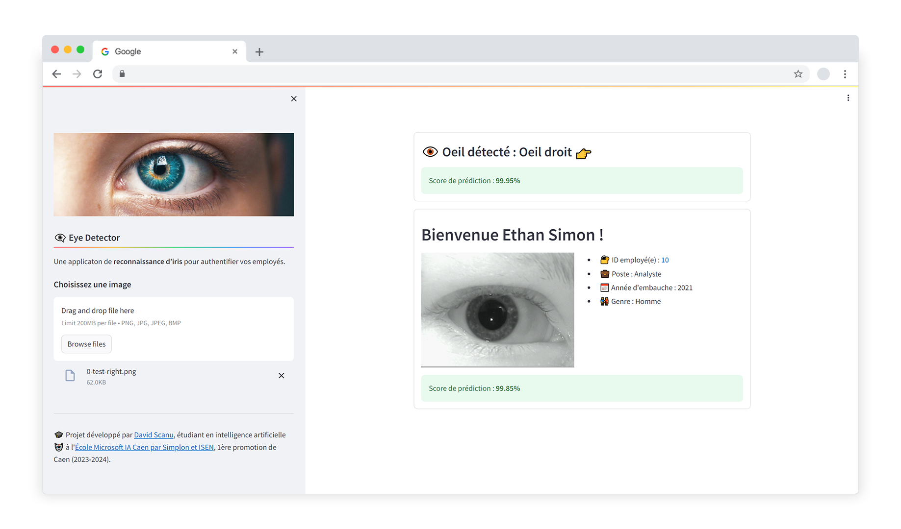

</img>

# 👁️‍🗨️ E2 - Cas Pratique 1 : "Reconnaissance d'iris"

Ce **cas pratique : "Reconnaissance d'iris"** témoigne de la maîtrise des compétences visées pour l'obtention du titre professionnel : [Développeur en intelligence artificielle (RNCP 34757)](https://www.francecompetences.fr/recherche/rncp/34757/), délivré par [Simplon](https://simplon.co/), dans le cadre de l'[École Microsoft IA Caen par Simplon et ISEN](https://isen-caen.fr/ecole-ia-microsoft-by-simplon-et-isen-ouest/). Ce cas pratique implique l'amélioration d'un modèle de vision par ordinateur, ainsi que le développement d'une application web qui le déploie.

## Description du cas pratique

Vous êtes un développeur IA, votre entreprise vous a confié la mission de **développer une interface de reconnaissance d’oeil pour une entreprise souhaitant authentifier ses 45 employés** à partir d’un scan de leurs yeux.

## Description des dossiers

- `consignes` : Ensemble des consignes et des données pour mener le projet.
- `streamlit-app` : Application front-end pour effectuer les prédictions à partir de photos d'yeux.

## Améliorations du programme d’IA

Pour s’assurer d’améliorer les performances du nouveau modèle de détection biométriques, voici les préconisations essentielles :

- **Développer 3 classificateurs** : 
  - Un classificateur qui détecte l'œil gauche ou l'œil droit
  - Un classificateur qui détecte l’ID de l’employé à partir de l'œil gauche
  - Un classificateur qui détecte l’ID de l’employé à partir de l'œil droit
- **Essayer différentes architecture de modèle** : essayer différentes architectures pré-entraînées sur ImageNet disponibles avec Keras.
- **Augmentation de données** : présenter plus de photos lors de l'entraînement aidera le nouveau modèle à mieux classer les images d’yeux. 
- **Modifier les hyperparamètres** : en jouant sur les hyperparamètres, nous pourrons obtenir un gain de performance.

## Notebooks

| Notebook | Colab |
| --- | --- |
| Classificateur qui détecte si l'image est un oeil gauche ou un oeil droit. |  |
| Classificateur qui retrouve l'identifiant d'un employé à partir de l'image de son oeil gauche ou droit |  |

## Application Streamlit

Application Streamlit de détection d'un employé à partir d'une photo de son oeil.

## A propos 

> 🎓 Projet développé par [David Scanu](https://www.linkedin.com/in/davidscanu14/), étudiant en intelligence artificielle 🤖 à l'[École Microsoft IA Caen par Simplon et ISEN](https://isen-caen.fr/ecole-ia-microsoft-by-simplon-et-isen-ouest/), 1ère promotion de Caen (2023-2024).
